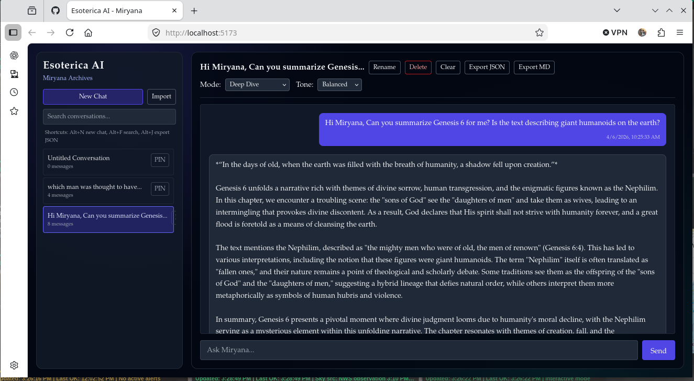

# Esoterica AI

Esoterica AI is a comparative religion and myth analysis chatbot powered by a FastAPI backend and React frontend.

Miryana is the guiding voice: wise, grounded, and citation-aware.

## Preview



## What Works Today

- FastAPI chat backend with OpenAI integration.
- Retrieval-augmented generation (RAG) using FAISS.
- Seed corpus + ingestion script.
- React chat UI with:
  - Quick Summary / Deep Dive mode
  - Balanced / Poetic / Scholarly tone selector
  - Inline source citation pills
  - Multi-conversation history (create, rename, delete, clear)
  - Pinned/favorite conversations (persisted)
  - Timestamped messages
  - Export active conversation as JSON or Markdown
  - Import conversation JSON exports back into the app
  - Keyboard shortcuts: `Alt+N` (new), `Alt+F` (search), `Alt+J` (export JSON)

## Tech Stack

- Backend: FastAPI, OpenAI Python SDK, FAISS, python-dotenv
- Frontend: Vite, React, Tailwind, Axios

## Repository Layout

```text
backend/
  app.py
  ingest.py
  requirements.txt
  .env.example
  data/
    corpus/
frontend/
  package.json
  index.html
  src/
persona.md
roadmap
```

## Prerequisites

- Python 3.11+
- Node.js 18+ (or 20+ recommended)
- npm
- OpenAI API key

## Quick Start (Minimal Headache)

Run from project root (`Esoterica/`) unless noted.

### 1. Backend setup

```bash
cd backend
python -m venv .venv
source .venv/bin/activate
python -m pip install --upgrade pip
pip install -r requirements.txt
cp .env.example .env
```

Edit `backend/.env` and set your key:

```env
OPENAI_API_KEY=sk-...
MODEL_NAME=gpt-4o-mini
EMBEDDING_MODEL=text-embedding-3-small
RETRIEVAL_TOP_K=4
OPENAI_TIMEOUT_SEC=45
VECTOR_STORE_PATH=./data/vector_store.faiss
CHAT_DB_PATH=./data/chat_history.db
```

### 2. Build the vector store (one-time or when corpus changes)

```bash
cd backend
source .venv/bin/activate
python ingest.py
```

Expected outputs:

- `backend/data/vector_store.faiss`
- `backend/data/vector_store.meta.json`

### 3. Start backend

```bash
cd backend
source .venv/bin/activate
uvicorn app:app --reload --port 8000 --app-dir $(pwd)
```

Health check:

- http://127.0.0.1:8000/health

### 4. Start frontend

Open a second terminal:

```bash
cd frontend
npm install
npm run dev
```

Open:

- http://localhost:5173

If backend is not on port 8000, create `frontend/.env`:

```env
VITE_API_BASE=http://localhost:8000
```

Restart frontend after `.env` changes.

## Day-to-Day Dev Commands (Linux / macOS)

One-command startup:

```bash
./dev-up.sh
```

What it does:

- Validates that `backend/.venv` and `frontend/package.json` exist
- Runs `npm install` if `node_modules` is missing
- Starts the FastAPI backend on `:8000` (background process, cleaned up on exit)
- Waits 2 seconds, then opens `http://localhost:5173` in the default browser (`xdg-open` on Linux, `open` on macOS — see note below)
- Starts the Vite frontend dev server in the foreground on `:5173`
- Ctrl+C stops everything cleanly

Optional custom ports:

```bash
BACKEND_PORT=8001 FRONTEND_PORT=5174 ./dev-up.sh
```

> **macOS note:** `dev-up.sh` calls `xdg-open`. On macOS replace that line with `open` or just open the URL manually.

Manual commands if you prefer:

```bash
# Backend (terminal 1)
cd backend && source .venv/bin/activate && uvicorn app:app --reload --port 8000

# Frontend (terminal 2)
cd frontend && npm run dev
```

Rebuild vectors after adding corpus files:

```bash
cd backend && source .venv/bin/activate && python ingest.py
```

---

## Running on Windows

`dev-up.sh` is a bash script and will not run natively on Windows. You have two options:

### Option A — WSL2 (Recommended)

The smoothest path on Windows is [Windows Subsystem for Linux 2](https://learn.microsoft.com/en-us/windows/wsl/install). Once WSL2 is installed with an Ubuntu distribution, the full Linux Quick Start above works verbatim — including `./dev-up.sh`.

Install WSL2 from an elevated PowerShell prompt:

```powershell
wsl --install
```

Restart the machine, open a WSL Ubuntu terminal, clone/navigate to the project, and proceed with the Linux steps.

### Option B — Native PowerShell

If WSL2 is not an option, run all steps manually in **PowerShell 7+** (or PowerShell 5.1).

#### 1. Allow script execution (one-time)

```powershell
Set-ExecutionPolicy -ExecutionPolicy RemoteSigned -Scope CurrentUser
```

#### 2. Backend setup

```powershell
cd backend
python -m venv .venv
.\.venv\Scripts\Activate.ps1
python -m pip install --upgrade pip
pip install -r requirements.txt
Copy-Item .env.example .env
```

Edit `backend\.env` and fill in your credentials (same variables listed in the Quick Start section above).

#### 3. Build the vector store (one-time)

```powershell
cd backend
.\.venv\Scripts\Activate.ps1
python ingest.py
```

#### 4. Start backend

```powershell
cd backend
.\.venv\Scripts\Activate.ps1
uvicorn app:app --reload --port 8000
```

Health check: http://127.0.0.1:8000/health

#### 5. Start frontend

Open a **second** PowerShell window:

```powershell
cd frontend
npm install
npm run dev
```

Open: http://localhost:5173

#### Quick-launch both at once (PowerShell)

Run this from the project root to open both servers in separate windows and launch the browser:

```powershell
Start-Process powershell -ArgumentList "-NoExit", "-Command", "cd '$PWD\backend'; .\.venv\Scripts\Activate.ps1; uvicorn app:app --reload --port 8000"
Start-Process powershell -ArgumentList "-NoExit", "-Command", "cd '$PWD\frontend'; npm run dev"
Start-Sleep 3
Start-Process "http://localhost:5173"
```

#### Common Windows-specific issues

| Issue | Fix |
|---|---|
| `.ps1 cannot be loaded, execution of scripts is disabled` | Run `Set-ExecutionPolicy RemoteSigned -Scope CurrentUser` |
| `python` not found | Install from [python.org](https://www.python.org/downloads/) and tick **"Add to PATH"** during setup |
| `npm` not found | Install Node.js from [nodejs.org](https://nodejs.org/) (LTS recommended) |
| Port already in use on `:8000` | `Get-Process -Id (Get-NetTCPConnection -LocalPort 8000).OwningProcess \| Stop-Process` |

---

## Common Problems and Fixes

| Issue | Cause | Fix |
|---|---|---|
| `npm ERR! enoent ... Esoterica/package.json` | Running npm from repo root | Run npm commands from `frontend/` |
| `Address already in use` on `:8000` | Old backend process still running | `kill $(lsof -ti:8000)` then restart uvicorn |
| `rag_ready: false` in `/health` | Vector store missing or wrong path | Run `python ingest.py`, verify `VECTOR_STORE_PATH` |
| 404/failed chat in UI | Backend not running or wrong API base | Start backend; verify `VITE_API_BASE` |
| No citations in responses | Retrieval not loaded | Confirm `/health` shows `rag_ready: true` |

## Notes

- `persona.md` is loaded by backend and used in system prompt construction.
- `backend/data/corpus/` currently contains seed summary texts for bootstrapping.
- Conversation and message history are persisted in SQLite at `CHAT_DB_PATH`.
- Real secrets belong in local `.env` only. Never commit credentials.

## Roadmap

See `roadmap` for upcoming phases and expansion ideas.

---

## Support

If you find Esoterica useful, consider supporting development:

- **CashApp:** `$therealajnelson`